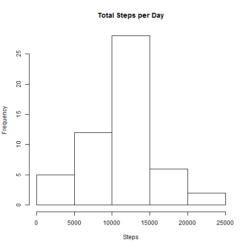

Reproducible Research Assignment 1
===============================================

Loading and preprocessing the data
----------------------------------

*Loading the data


```r
library(chron)
library(lubridate)
library(dplyr)
library(ggplot2)
data <- read.csv("activity.csv")
```

What is mean total number of steps taken per day?
-------------------------------------------------

Calculate the total number of steps taken per day


```r
totalStepsPerDay <- aggregate(steps ~ date, data, sum)
```

Make a histogram of the total number of steps taken each day


```r
hist(totalStepsPerDay$steps, main = "Total Steps per Day", xlab = "Steps")
```

 

Calculate and report the mean and median of the total number of steps taken per day

Mean

```r
mean(totalStepsPerDay$steps)
```

```
## [1] 10766.19
```

Median

```r
median(totalStepsPerDay$steps)
```

```
## [1] 10765
```

What is the average daily activity pattern?
-------------------------------------------
Make a time series plot of the 5-minute interval (x-axis) and the average number of steps taken, averaged across all days (y-axis)


```r
avgStepsByInterval <- aggregate(steps ~ interval, data, mean)
plot(avgStepsByInterval$interval, avgStepsByInterval$steps, type = "l" , xlab="Interval", ylab="Avg. steps")
```

 

Which 5-minute interval, on average across all the days in the dataset, contains the maximum number of steps?

```r
avgStepsByInterval[avgStepsByInterval$steps == max(avgStepsByInterval$steps),][,"interval"]
```

```
## [1] 835
```


Inputing missing values
-----------------------
Calculate and report the total number of missing values in the dataset (i.e. the total number of rows with NAs)

```r
incompleteCases <- data[!complete.cases(data),]
length(incompleteCases$steps)
```

```
## [1] 2304
```

Devise a strategy for filling in all of the missing values in the dataset.
```
Replacing NA steps with the mean for the interval
```

Create a new dataset that is equal to the original dataset but with the missing data filled in.

```r
filleData <- data
#replacing NAs with mean for that interval
for (i in 1:length(filleData$steps)) {
    if (is.na(filleData[i,"steps"])) {
      filleData[i,"steps"] <- avgStepsByInterval[avgStepsByInterval$interval == filleData[i,"interval"],][,"steps"]
    }
    
}
```

Make a histogram of the total number of steps taken each day and Calculate and report the mean and median total number of steps taken per day.

```r
totalStepsPerDayFil <- aggregate(steps ~ date, filleData, sum)
hist(totalStepsPerDayFil$steps, main = "Total Steps per Day", xlab = "Steps")
```

 

```r
mean(totalStepsPerDayFil$steps)
```

```
## [1] 10766.19
```

```r
median(totalStepsPerDayFil$steps)
```

```
## [1] 10766.19
```


Are there differences in activity patterns between weekdays and weekends?
-------------------------------------------------------------------------

Create a new factor variable in the dataset with two levels - "weekday" and "weekend" indicating whether a given date is a weekday or weekend day.

```r
wkndData <- mutate(filleData, IsWeekend = gsub("FALSE", "weekday", gsub("TRUE", "weekend", is.weekend(date))))
```

Make a panel plot containing a time series plot (i.e. type = "l") of the 5-minute interval (x-axis) and the average number of steps taken, averaged across all weekday days or weekend days (y-axis).

```r
avgStepsByIntAndWknd <- aggregate(steps ~ interval + IsWeekend, wkndData, mean)
qplot(interval, steps, data = avgStepsByIntAndWknd, facets = . ~ IsWeekend, geom=c("point", "line"), color = IsWeekend) +
  labs(title="Avg Steps by Interval and Weekend Status", x="Interval", y="Steps") +
  facet_wrap(facets=~IsWeekend, nrow = 2)
```

 


